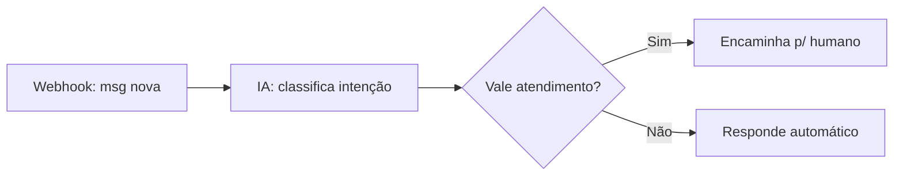
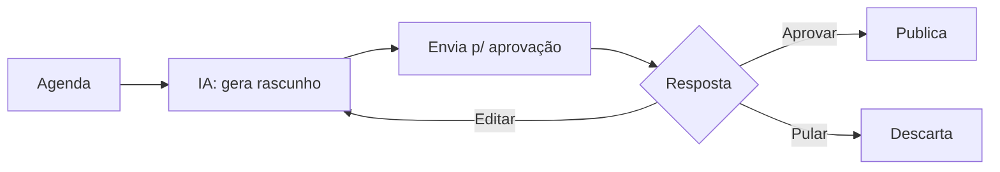
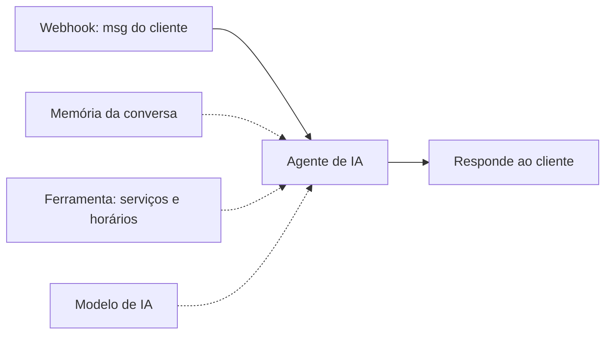
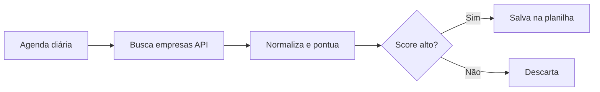

# n8n-automations

Coleção de automações que construí no **n8n** para resolver problemas reais de operação e
marketing: atendimento, geração de conteúdo, aprovação e integração entre ferramentas.

> ⚠️ **São exemplos genéricos.** Reconstruí cada fluxo do zero, sem credenciais, sem números de
> telefone, sem prompts ou dados de nenhum cliente. A ideia é mostrar a **arquitetura e a lógica**,
> não expor projetos privados.

## Como usar
Cada arquivo em [`workflows/`](workflows/) é um workflow n8n exportado. Para testar:
1. No n8n, vá em **Workflows → Import from File**.
2. Selecione o `.json`.
3. Conecte suas próprias credenciais (OpenAI, WhatsApp, etc.) nos nós marcados.

---

## Workflows

### 🤖 `qualifica-lead-whatsapp.json`
**Problema:** todo lead novo que chega no WhatsApp precisa de resposta rápida, mas nem todo lead
merece o tempo de um atendente humano.
**Como resolve:** o fluxo recebe a mensagem por webhook, usa um modelo de IA para classificar a
intenção (interessado, dúvida, fora do perfil) e decide: responde automaticamente os casos simples
ou encaminha para um humano quando vale a pena.

### ✍️ `gera-post-ia-aprovacao.json`
**Problema:** produzir conteúdo com constância é caro, mas publicar sem revisão humana é arriscado.
**Como resolve:** um gatilho agendado pede à IA um rascunho de post, envia para aprovação (mensagem
com Aprovar / Editar / Pular) e só publica depois do "ok" humano. Automatiza o trabalho braçal e
mantém o controle editorial.

### 💬 `atendimento-ia-whatsapp.json`
**Problema:** clientes mandam mensagem a qualquer hora e esperam resposta na hora — mas a resposta
precisa ser certa (horário, serviço, preço), não uma alucinação da IA.
**Como resolve:** um **agente de IA** com memória de conversa (lembra o contexto de cada cliente) e uma
**ferramenta** de consulta de serviços/horários. O agente só responde sobre dados reais via ferramenta e
encaminha para um humano quando o caso foge do padrão. Mostra o pacote completo: agente + memória
por sessão + tool calling + `Respond to Webhook`.

### 🎯 `prospecta-leads.json`
**Problema:** achar clientes em potencial na mão é lento e repetitivo.
**Como resolve:** pipeline agendado que busca empresas de um segmento, **normaliza e pontua** cada uma
por um score de prioridade (ex.: quem não tem site é oportunidade), filtra as que valem contato e salva
numa planilha. Mostra manipulação de dados com Code node, filtro e integração com Google Sheets.

---

## Sobre mim
Designer que virou desenvolvedor de automações. Junto **design + código** para construir
ferramentas úteis — e que também são boas de usar.
📫 allanth.designer@gmail.com
